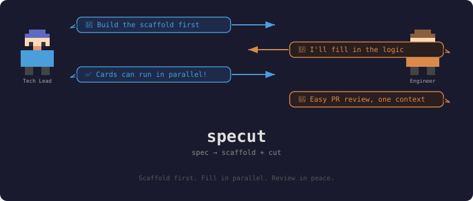

<div align="center">



# 🏗️ specut

**spec → scaffold + cut**

Break milestone features into cards that enable **parallel development** and **effortless PR review**.

[](https://github.com/addison-w/specut-skill)
[](https://skills.sh/)

</div>

---

## 🎯 The Problem

You have a big milestone feature. You ask AI to break it into 5 Jira cards. Sounds great — except:

| 😤 Pain | 💥 Result |
|---------|-----------|
| Cards must be done in order 1→2→3→4→5 | Team can't work in parallel |
| Someone goes on sick leave at card #3 | Entire team blocks or re-does #3 |
| Cards are horizontal slices (DB layer, API layer, UI layer) | Nothing works until ALL cards are done |
| Cards are huge (3-day scope) | PR review is a nightmare — 1000+ lines, multiple contexts |

**The root cause**: the cards were cut wrong.

---

## 💡 The Idea

**Scaffold first, then fill in parallel.**

Instead of 5 sequential cards, specut produces:

### 🧱 1 Scaffold Card
Build the "surface" of the entire feature — interfaces, stubs, fake data. The skeleton compiles and runs, but does nothing real. Think of it as the wireframe of a house: walls are up, rooms are defined, but no furniture.

### 🔧 N Fill Cards
Each fill card is a **narrow vertical slice** — it fills real logic into one pipe of the scaffold. Independent, testable, and small enough for a comfortable PR review.

```
  Traditional           Specut
  ──────────────       ──────────────
  Card 1: DB layer     🧱 SCAFFOLD: wire up the skeleton
  Card 2: Service      ↓ (hard dependency)
  Card 3: API          🔧 FILL 1: email login
  Card 4: UI           🔧 FILL 2: Stripe payment    ← all parallel!
  Card 5: Integration  🔧 FILL 3: cart retrieval    ←
  ↓                    🔧 FILL 4: order creation     ←
  Nothing works        ↓
  until card 5 ✅      Each card works on its own ✅
```

---

## ✨ Key Features

- 🏗️ **Scaffold-first architecture** — one card builds the skeleton, all other cards fill in parallel
- 🔪 **Narrow vertical slices** — each fill card touches one pipe, one review context
- 🧪 **Spike validation** — AI builds a throwaway skeleton in a git worktree to verify the architecture actually works before cutting cards
- 📋 **Conflict-aware** — soft dependency warnings when two fill cards might step on each other
- 🎯 **Tech-decision agnostic** — scaffold defines direction, fill-card authors make the implementation decisions
- 📦 **Output to anything** — produces a markdown file you can paste into Jira, GitHub Issues, Linear, Notion, or a sticky note

---

## 🚀 Install

```bash
npx skills add addison-w/specut-skill -g -y
```

That's it. Then tell your AI agent:

> "Use specut to break down the checkout feature"

---

## 🔮 How It Works

### Step 1: Clarify
The skill asks you four questions:
1. **What are we building?** — feature description
2. **Spike mode** — `full` / `light` / `none` (see below)
3. **Core user paths** — the vertical paths this feature enables
4. **Tech stack** — auto-detected from your project, you confirm

### Step 2: Spike 🧪
AI creates a git worktree and builds a throwaway skeleton to validate the architecture. If the spike reveals a blocking problem, it stops and talks to you before proceeding.

### Step 3: Cut ✂️
Outputs a `specut-{feature}.md` file with:
- **1 scaffold card** — intent, core user paths, interface direction, acceptance criteria
- **N fill cards** — each a narrow vertical slice with intent, AC, blocked-by, and conflict warnings

### Step 4: Cleanup 🧹
The worktree is removed. Spike code was reference only — never merged.

---

## ⚡ Spike Modes

| Mode | What it does | When to use |
|------|-------------|-------------|
| 🔴 **full** | Runnable skeleton: interfaces, stubs, fake data, wires up. Build passes. | Large features, high architecture uncertainty |
| 🟡 **light** | Critical interface boundaries + key dependency checks only | Medium features, mostly confident on architecture |
| 🟢 **none** | Skip spike, cut cards from reasoning alone | Small features, tech lead has clear architecture |

---

## 📄 Output Example

```markdown
# Checkout Feature

## SCAFFOLD

### Intent
Enable customers to review their cart, pay, and receive order confirmation.

### Core user paths
**Path 1: Review cart**
- Layers: DB → CartService → API → UI
- Interface direction: CartService exposes cart retrieval by user ID

**Path 2: Submit payment**
- Layers: DB → PaymentService → OrderService → API → UI
- Interface direction: PaymentService.processPayment() → OrderService.createOrder()

### Acceptance criteria
- [ ] All stubs compile and return fake data
- [ ] Each user path has a reachable API endpoint
- [ ] No real business logic — stubs and fake data only
- [ ] Interface direction is documented but not locked

---

## FILL 1: Add Stripe payment processing

### Intent
Process real payments through Stripe.

### User path
Path 2: Submit payment

### Acceptance criteria
- [ ] PaymentService.processPayment() calls Stripe API
- [ ] Success creates payment record in DB
- [ ] Failure returns appropriate error codes
- [ ] Tests pass independently

### Blocked by
- SCAFFOLD Checkout Feature (hard dependency)

### ⚠️ Potential conflicts
- FILL 3: both modify payment schema
```

See [EXAMPLES.md](EXAMPLES.md) for a complete example.

---

## 🧭 Design Principles

| Principle | What it means |
|-----------|--------------|
| **Tech decisions belong to the implementer** | Scaffold defines direction, not implementation |
| **Interface direction is fuzzy** | Fill cards adjust boundaries as needed — merge conflicts are acceptable cost |
| **One fill card = one review context** | Reviewer holds one concept, not five |
| **Narrow vertical slices** | "Add email login", not "Implement authentication system" |
| **Spike validates, never ships** | Worktree code is reference, never merged |
| **Output is format-agnostic** | Markdown goes into Jira, GitHub, Linear, or wherever |

---

## 📖 The Mental Model

Think of it like building a skyscraper:

```
🧱 Scaffold = the steel frame
   → Defines the shape. Every floor, every room, every conduit.
   → No drywall, no furniture, no paint. But it stands.

🔧 Fill cards = the buildout
   → Each card finishes one floor (or one room on every floor).
   → Electricians, plumbers, painters all work in parallel.
   → They respect the frame, but choose their own materials.
```

The old way is building floor by floor — nothing usable until the top floor is done. Specut builds the frame first, then lets every tradesperson start immediately.

---

## 📚 Documentation

- [SKILL.md](SKILL.md) — Main instructions (what the AI reads)
- [REFERENCE.md](REFERENCE.md) — Card templates, spike modes, sizing rules, conflict detection
- [EXAMPLES.md](EXAMPLES.md) — Full e-commerce checkout example

---

## 🤝 Contributing

Found a bug or have an idea? Open an issue at [addison-w/specut-skill](https://github.com/addison-w/specut-skill/issues).

---

<div align="center">

**Scaffold first. Fill in parallel. Review in peace.** ✂️

</div>